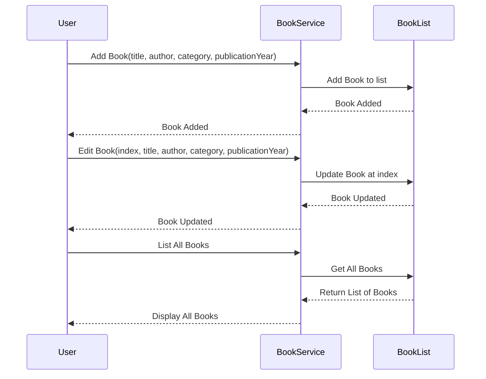

# Book Tracking App

## Overview

The **Book Tracking App** is a simple command-line application that allows users to manage a collection of books. The app supports adding, editing, deleting, and listing books. Additionally, it provides a summary showing the total number of books in each category. The app is designed with proper encapsulation, input validation, and a simple text-based user interface.

## Data Model Requirements

### Book Class
The **Book** class represents a book object with the following properties:
- **String title** - The title of the book.
- **String author** - The author of the book.
- **String category** - The category of the book (e.g., Fiction, Science, etc.).
- **int publicationYear** - The year the book was published.

### Input Validation
- The **publicationYear** must be a valid year (not in the future).
- All fields (**title**, **author**, **category**, **publication year**) must be filled. Null or empty values are not accepted.

### Database Interaction
- The app uses an in-memory data structure (e.g., `ArrayList<Book>`) to store book details.

## Functional Requirements

1. **Add a Book**: Add a new book to the collection, ensuring all fields are filled and the publication year is not in the future.
2. **Edit a Book**: Modify an existing book’s details based on a zero-based index.
3. **Delete a Book**: Remove a book from the collection by its index in the list.
4. **List All Books**: Display all books currently stored in the collection.
5. **Show Summary**: Provide a summary showing the total number of books in each category.

## User Interface

- The user interface is text-based, utilizing Java's standard input and output (`System.in` and `System.out`).
- Menu options include:
  - **Add Book**
  - **Edit Book**
  - **Delete Book**
  - **List All Books**
  - **Show Summary**
  - **Exit**

## Design Considerations

- The app follows SOLID principles for maintainability.
- The system uses simple design (KISS) and avoids unnecessary complexity (YAGNI).
- Proper exception handling is implemented for unexpected inputs or errors.

## Technical Expectations

- The application is organized with clear class separations and method responsibilities.
- Comments and documentation are included to explain the code logic.
- Exception handling is applied to manage errors effectively.

## Sequence Diagram (Mermaid Syntax)

Below is a Mermaid sequence diagram illustrating the interactions for adding, editing, and displaying books.



## How to Run

1. Clone the repository:
   ```bash
   git clone https://github.com/KavyaMacha/BookTrackingApp.git
   ```

2. Navigate to the project directory:
   ```bash
   cd BookTrackingApp
   ```

3. Compile the Java files:
   ```bash
   javac src/main/java/org/epam/campus/*.java
   ```

4. Run the application:
   ```bash
   java org.epam.campus.presentation.BookConsoleApp
   ```

## Example Usage

Upon running the application, the user will be presented with a menu to choose an action. For example:

```
1. Add Book
2. Edit Book
3. Delete Book
4. List All Books
5. Show Summary
6. Exit
Enter your choice: 1
Enter book title: The Catcher in the Rye
Enter book author: J.D. Salinger
Enter book category: Fiction
Enter publication year: 1951
Book Added Successfully!
```

---

This README provides an overview and usage instructions for your **Book Tracking App**. It includes specifications, technical details, and an example sequence diagram to illustrate the system's interactions.
